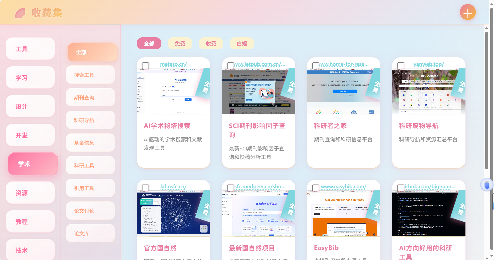

# Collections - 网站收藏夹

一个现代化的网站收藏夹应用，具有美观的糖果色主题和双层级侧边栏设计。



## ✨ 功能特性

### 🎨 界面设计
- **糖果色主题**：采用粉色和橙色的渐变设计
- **双层级侧边栏**：主分类和子分类的层次化导航
- **毛玻璃效果**：现代化的backdrop-filter模糊效果
- **流畅动画**：光泽扫过和状态转换动画
- **响应式设计**：适配不同屏幕尺寸

### 📚 内容管理
- **网站收藏**：支持添加、编辑、删除网站链接
- **分类管理**：主分类和子分类的灵活组织
- **标签系统**：免费/白嫖/收费标签分类
- **图片预览**：每个网站都有对应的预览图片
- **搜索过滤**：按分类和标签快速筛选

### 🔧 技术特性
- **纯前端实现**：HTML + CSS + JavaScript
- **本地存储**：使用localStorage保存数据
- **API模拟**：模拟后端API接口
- **文件上传**：支持图片文件上传预览
- **数据同步**：多页面间数据同步

## 🚀 快速开始

### 环境要求
- 现代浏览器（Chrome、Firefox、Safari、Edge）
- 支持ES6+语法
- 支持CSS3特性

### 安装步骤

1. **克隆项目**
```bash
git clone [项目地址]
cd collections
```

2. **启动服务器**
```bash
# 如果有Node.js环境
npm install
npm start

# 或者使用Python
python -m http.server 3000

# 或者使用PHP
php -S localhost:3000
```

3. **访问应用**
打开浏览器访问 `http://localhost:3000`

## 📁 项目结构

```
collections/
├── index.html              # 主页面
├── note.html              # 笔记页面
├── upload.html            # 上传页面
├── main.js               # 主页面逻辑
├── note.js               # 笔记页面逻辑
├── upload.js             # 上传页面逻辑
├── categoryEnum.js       # 分类枚举
├── config.js             # 配置文件（API令牌等）
├── style.css             # 样式文件
├── server.js             # 服务器文件
├── package.json          # 项目配置
├── README.md             # 项目说明
├── pic/                  # 项目图片文件夹
│   └── screenshot.png
└── data/
    ├── sites.json        # 网站数据
    ├── saveImage.js      # 图片保存逻辑
    └── images/           # 图片文件夹
        ├── AI工具图片.jpg
        ├── 学术工具图片.jpg
        └── ...
```

### 配置文件说明

#### config.js
- **作用**：存储API令牌和全局配置
- **内容**：包含API_TOKEN等敏感信息
- **使用**：在浏览器和Node.js环境中均可使用
- **安全**：请根据实际需要修改TOKEN值

## 🎯 核心功能

### 1. 网站收藏管理
- **添加网站**：通过上传页面添加新的网站链接
- **编辑信息**：修改网站标题、描述、分类等
- **删除网站**：移除不需要的收藏
- **批量操作**：支持批量管理功能

### 2. 分类系统
- **主分类**：如"AI工具"、"学术工具"、"设计工具"等
- **子分类**：在主分类下的细分，如"AI写作"、"AI绘画"等
- **动态分类**：根据数据自动生成分类结构

### 3. 标签系统
- **免费**：完全免费的网站和工具
- **白嫖**：可以免费使用的付费工具
- **收费**：需要付费的服务

### 4. 搜索和过滤
- **分类过滤**：按主分类和子分类筛选
- **标签过滤**：按免费/白嫖/收费标签筛选
- **实时搜索**：输入关键词实时过滤结果

## 🎨 设计特色

### 糖果色主题
- **主色调**：粉色系 (#ff6b9d)
- **辅助色**：橙色系 (#ffa07a)
- **渐变效果**：多层次渐变增加视觉深度
- **毛玻璃**：现代化的模糊效果

### 双层级侧边栏
- **主侧边栏**：显示主分类，使用粉色主题
- **子侧边栏**：显示子分类，使用橙色主题
- **层次分明**：清晰的视觉层次结构
- **交互反馈**：悬停和激活状态的视觉反馈

### 动画效果
- **光泽扫过**：鼠标悬停时的光泽动画
- **状态转换**：流畅的激活状态转换
- **缩放效果**：悬停时的轻微缩放
- **位移效果**：点击时的位移反馈

## 🔧 技术栈

### 前端技术
- **HTML5**：语义化标签和现代HTML特性
- **CSS3**：Flexbox布局、Grid布局、动画效果
- **JavaScript ES6+**：模块化、异步编程、DOM操作
- **LocalStorage**：本地数据存储

### 样式特性
- **CSS Grid**：响应式网格布局
- **Flexbox**：灵活的盒模型布局
- **CSS动画**：关键帧动画和过渡效果
- **CSS变量**：主题色彩管理
- **媒体查询**：响应式设计

### 开发工具
- **Git**：版本控制
- **VS Code**：代码编辑器
- **Chrome DevTools**：调试工具

## 📱 响应式设计

### 桌面端 (1024px+)
- 完整双层级侧边栏显示
- 360px总宽度，180px每层级
- 丰富的动画和交互效果

### 平板端 (768px-1024px)
- 侧边栏可折叠
- 120px折叠宽度，360px展开宽度
- 保持主要功能可用

### 移动端 (480px-768px)
- 侧边栏完全折叠
- 100px折叠宽度，300px展开宽度
- 触摸友好的交互设计

### 小屏设备 (<480px)
- 最小化布局
- 垂直堆叠设计
- 简化的交互方式

## 🚀 部署指南

### 静态部署
1. 将所有文件上传到Web服务器
2. 确保服务器支持静态文件服务
3. 配置正确的MIME类型

### CDN部署
1. 将静态资源上传到CDN
2. 配置缓存策略
3. 启用Gzip压缩

### Docker部署
```dockerfile
FROM nginx:alpine
COPY . /usr/share/nginx/html
EXPOSE 80
CMD ["nginx", "-g", "daemon off;"]
```

## 🤝 贡献指南

### 开发环境设置
1. Fork项目到你的GitHub账户
2. 克隆你的Fork到本地
3. 创建功能分支：`git checkout -b feature/新功能`
4. 提交更改：`git commit -m '添加新功能'`
5. 推送分支：`git push origin feature/新功能`
6. 创建Pull Request

### 代码规范
- 使用ES6+语法
- 遵循JavaScript标准规范
- 保持代码简洁和可读性
- 添加适当的注释

### 提交规范
- feat: 新功能
- fix: 修复bug
- docs: 文档更新
- style: 代码格式调整
- refactor: 代码重构
- test: 测试相关
- chore: 构建过程或辅助工具的变动

## 📄 许可证

本项目采用 MIT 许可证 - 查看 [LICENSE](LICENSE) 文件了解详情

## 🙏 致谢

感谢所有为这个项目做出贡献的开发者！

## 📞 联系方式

如有问题或建议，请通过以下方式联系：
- 提交Issue
- 发送邮件
- 参与讨论

---

**享受你的网站收藏之旅！** 🎉